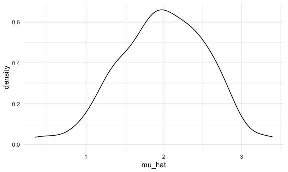
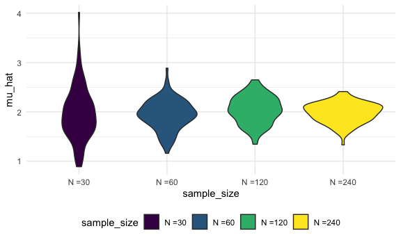
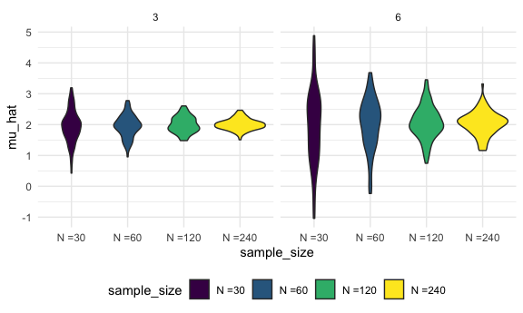

simulations
================

``` r
sim_mean_sd = function(n, mu = 2, sigma = 3) {
  
  sim_data = tibble(
    x = rnorm(n, mean = mu, sd = sigma)
  )
  
  sim_data %>% 
    summarize(
      mu_hat = mean(x),
      sigma_hat = sd(x)
    )
}
```

``` r
sim_mean_sd(n = 30)
```

    ## # A tibble: 1 × 2
    ##   mu_hat sigma_hat
    ##    <dbl>     <dbl>
    ## 1   2.25      2.77

how can we use this now

write a for loop!

``` r
output = vector("list", length = 100)

for (i in 1:100) {
  output[[i]] = sim_mean_sd(n = 30)
}

bind_rows(output)
```

    ## # A tibble: 100 × 2
    ##    mu_hat sigma_hat
    ##     <dbl>     <dbl>
    ##  1   2.40      2.39
    ##  2   2.33      2.88
    ##  3   2.34      2.65
    ##  4   1.01      2.77
    ##  5   2.71      3.17
    ##  6   2.20      3.25
    ##  7   1.29      3.04
    ##  8   2.07      2.79
    ##  9   2.41      3.09
    ## 10   2.65      2.84
    ## # … with 90 more rows

let’s use list columns instead

``` r
sim_results_df =
  expand_grid(
  sample_size = 30,
  iteration = 1:100
) %>% 
  mutate(
    estimate_df = map(sample_size, sim_mean_sd)
  ) %>% 
  unnest(estimate_df)
```

``` r
sim_results_df %>% 
  ggplot(aes(x = mu_hat)) + geom_density()
```



## what abt changing sample size

I need a input list with lots of sample sizes.

``` r
sim_results_df =
  expand_grid(
  sample_size = c(30, 60, 120, 240),
  iteration = 1:100
) %>% 
  mutate(
    estimate_df = map(sample_size, sim_mean_sd)
  ) %>% 
  unnest(estimate_df)
```

``` r
sim_results_df %>% 
  mutate(
    sample_size = str_c("N =", sample_size),
    sample_size = fct_inorder(sample_size)
  ) %>% 
  ggplot(aes(x = sample_size, y = mu_hat, fill = sample_size)) +
  geom_violin()
```



``` r
sim_results_df %>% 
  pivot_longer(
    mu_hat:sigma_hat,
    names_to = "parameter", 
    values_to = "estimate") %>% 
  group_by(parameter, sample_size) %>% 
  summarize(
    emp_mean = mean(estimate),
    emp_var = var(estimate)) 
```

    ## # A tibble: 8 × 4
    ## # Groups:   parameter [2]
    ##   parameter sample_size emp_mean emp_var
    ##   <chr>           <dbl>    <dbl>   <dbl>
    ## 1 mu_hat             30     1.96  0.279 
    ## 2 mu_hat             60     1.94  0.0903
    ## 3 mu_hat            120     2.04  0.0795
    ## 4 mu_hat            240     1.98  0.0410
    ## 5 sigma_hat          30     3.01  0.166 
    ## 6 sigma_hat          60     2.94  0.0875
    ## 7 sigma_hat         120     2.99  0.0356
    ## 8 sigma_hat         240     3.03  0.0234

## Let’s see two inputs

map2 function for 2 arguments, also can be used in map can only use .x
and .y

``` r
sim_results_df =
  expand_grid(
  sample_size = c(30, 60, 120, 240),
  true_sigma = c(6,3),
  iteration = 1:100
) %>% 
  mutate(
    estimate_df = map2(.x = sample_size, .y = true_sigma, ~sim_mean_sd(n = .x, sigma = .y))
  ) %>% 
  unnest(estimate_df)
```

plot and see difference in sigma

``` r
sim_results_df %>% 
  mutate(
    sample_size = str_c("N =", sample_size),
    sample_size = fct_inorder(sample_size)
  ) %>% 
  ggplot(aes(x = sample_size, y = mu_hat, fill = sample_size)) +
  geom_violin() +
  facet_grid( . ~ true_sigma)
```


